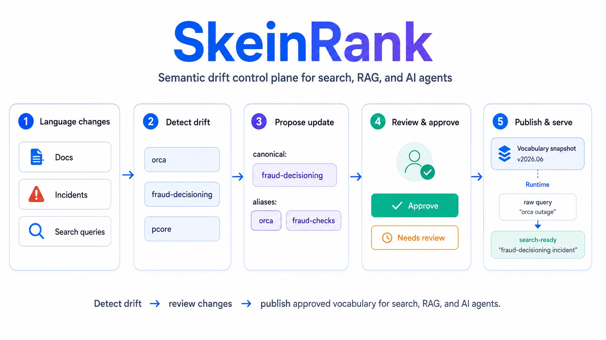

<p align="center">
  <a href="https://skeinrank.github.io">
    
  </a>
</p>

<h1 align="center">SkeinRank</h1>

<p align="center">
  <strong>Your RAG was great in January. It is quietly worse now —<br/>and nobody changed the model.</strong>
</p>

<p align="center">
  Your team's language drifts. Features get renamed, slang piles up, acronyms collide.<br/>
  Your embedding model never learned your internal names, so retrieval rots silently.<br/>
  <strong>SkeinRank is the open-source control plane that keeps your search vocabulary under control as it drifts.</strong>
</p>

<p align="center">
  <a href="https://skeinrank.github.io/getting-started/quickstart/"><strong>Quickstart</strong></a>
  ·
  <a href="https://skeinrank.github.io">Website</a>
  ·
  <a href="https://skeinrank.github.io/getting-started/installation/">Docs</a>
  ·
  <a href="https://pypi.org/project/skeinrank/">PyPI</a>
</p>

<p align="center">
  <a href="https://github.com/SkeinRank/skeinrank/actions/workflows/ci.yml"></a>
  <a href="https://pypi.org/project/skeinrank/"></a>
  <a href="LICENSE"></a>
  <a href="https://skeinrank.github.io"></a>
</p>


<p align="center">
  
</p>

<p align="center">
  <em>
    Detect vocabulary drift, review proposed changes, and publish approved snapshots for search, RAG, and AI agents.
  </em>
</p>

---

## The problem nobody is measuring

Retrieval quality is not static. It decays.

```text
January:  on-call types "checkout timeout"  →  finds the right runbook ✓
June:     the feature is now "payments-core" in docs
          on-call still types "the checkout thing"
          the runbook never matches  →  silent miss ✗
```

Nobody changed the model. Your **team** changed. Features get renamed, slang accumulates, new docs use new words while old docs use old ones, and the same acronym means two different things to two teams.

Your embedding model can't save you here: your internal names were never on the public internet, so it **guesses** — and as your language drifts, those guesses rot. No error. No alert. Just retrieval that is a few percent worse every month until someone says *"the bot got dumb."*

**The uncomfortable part:** your vocabulary is the one input to retrieval that changes constantly — and no system owns it, versions it, or tells you when it drifts.

That is the gap SkeinRank fills.

## Try it in 60 seconds

No Docker. No Elasticsearch. No config file. Just the idea, working:

```bash
pip install skeinrank
```

```python
import skeinrank

# Your team's slang → the words your search engine actually indexed
skeinrank.canonicalize("k8s pg timeout")
# → "kubernetes postgresql timeout"

# Same three letters, two realities — resolved by context, not by guessing
skeinrank.canonicalize("pg timeout")   # → "postgresql timeout"
skeinrank.canonicalize("pg layout")    # → "page layout"
```

> An embedding model **probably** gets the first one right. The difference is that SkeinRank doesn't guess — it applies an **explicit, versioned, inspectable** rule. You can see it, diff it, and roll it back. That distinction is the whole product.

Now point it at your own docs and ask the only question that matters:

```bash
# Does your terminology still cover what your team is actually writing?
skeinrank drift-scan ./docs --profile platform_ops
```

```text
Terminology drift report
  covered surfaces        812
  NEW unmatched surfaces   47   ← language that entered your docs and nothing maps
  top drift:  "pcore" (9×)  "blue-deploy" (6×)  "the checkout thing" (4×)
```

**That report is the magic.** It is the thing your embedding model, your synonym file, and your vector DB physically cannot give you: *a measurement of how far your live language has drifted from the vocabulary your search relies on.*

→ Full walkthrough: [`docs/guides/terminology-drift-report.md`](docs/guides/terminology-drift-report.md) · [`examples/drift-scan`](examples/drift-scan)

## Why this can't just be a synonym file

Every search engine has a synonym list. A synonym list is **configuration**. It cannot tell you:

- *which* version of your terminology is live right now;
- *who* approved an alias, and what evidence backed it;
- *how* to roll back a terminology change that hurt retrieval;
- *whether* your dictionary still covers last month's documents;
- *how* an AI agent can suggest a fix without write-access to production.

SkeinRank treats your terminology as a **governed, versioned, measurable asset** — sitting beside the search engine you already run, not replacing it.

```text
  raw query  ──▶  SkeinRank  ──▶  search-ready query  ──▶  your Elasticsearch / OpenSearch / vector DB
                  (canonicalize · disambiguate · pinned snapshot)
```

It adds **one field** to your documents and one resolution step to your queries. Your retrieval backend stays exactly where it is.

## How the value compounds

The 60-second SDK is the door. Behind it is a full lifecycle that turns drift from an invisible decay into a controlled loop:

```text
  detect drift  →  propose fix  →  prove with evidence  →  human approves  →  versioned snapshot  →  safe rollout
       ▲                                                                                                  │
       └──────────────────────────────  measure retrieval before / after  ◀──────────────────────────────┘
```

Every step is something a flat config file cannot do — and it is exactly what lets a system **keep scaling its document volume without letting search quality slide.**

<details>
<summary><strong>The closed loop, step by step</strong></summary>

| Step | What happens |
| --- | --- |
| **Discover** | Find internal terms, acronyms, aliases, and ambiguous surfaces — including drift in recent docs. |
| **Prove** | Attach evidence from documents, incidents, tickets, and search traces. |
| **Govern** | Review proposed changes through the AI Inbox and risk-aware policy. |
| **Snapshot** | Publish immutable, versioned terminology for runtime use. |
| **Bind** | Apply the right vocabulary to the right search context. |
| **Serve** | Expose API, SDK, CLI, and MCP tools for search, RAG, and agents. |
| **Evaluate** | Compare retrieval behavior *before and after* every terminology change. |

Production changes never touch the database directly — they flow through `proposal → validation → risk policy → review → snapshot → rollout`. Terminology is treated like code, not like a settings page.

</details>

<details>
<summary><strong>The endgame: drift, detected and repaired in the loop, with AI in the seat (humans holding the wheel)</strong></summary>

This is where SkeinRank is heading and what the architecture is built for.

As your document volume scales, drift accelerates. SkeinRank lets AI agents — through **MCP, scoped credentials, and strict RBAC** — continuously watch for drift and **propose** the fix: *"`pcore` now appears 40× and maps to nothing; suggest aliasing it to `payments-core`."*

Crucially, agents get **write-intent without write-access.** They submit proposals; they cannot mutate production. A human approves, a snapshot ships, retrieval is re-measured. That is real-time drift control with **human-in-the-loop** as a hard guarantee, not an afterthought — the part that makes scaling document volume safe instead of scary.

</details>

## What's in the box

SkeinRank is a **terminology sidecar** for teams already running Elasticsearch, OpenSearch, vector search, internal doc search, RAG, or AI-agent workflows. Pick the depth you need:

| If you want to… | Capability |
| --- | --- |
| Stop guessing where your language drifted | Terminology drift reports against live docs |
| Keep ambiguous aliases safe | Context-trigger disambiguation (`pg timeout` ≠ `pg layout`) |
| Apply the right vocabulary per index | Binding-aware runtime (profile + index + fields + pinned snapshot) |
| Manage terminology like code | Terminology-as-Code: lint · plan · apply · snapshot via GitOps |
| Approve changes with proof, not vibes | Evidence-assisted review + AI Inbox |
| Ship to search safely | Operator-controlled delivery: preflight · blue/green swap · rollback · pause/resume |
| Let agents help without risk | MCP tools with proposal-only scope |

### "But our search tools already have AI now"

They do — **inside their own walls.** Jira's AI searches Jira. Slack's AI searches Slack. Each learns your vocabulary privately and gives you no reusable layer. That doesn't fix fragmentation — it hardens it, sealing the logic inside models you can't inspect, version, or reuse.

SkeinRank sits *underneath* those tools: one canonical resolution of **your** language, as data **you own**, usable by your RAG, your search, your on-call bot, and your agents alike.

## Core model

| Concept | Meaning |
| --- | --- |
| `Profile` | Domain terminology: canonical values, aliases, slots, tags, stop lists. |
| `Binding` | Runtime context: profile + index/alias + fields + target field + pinned snapshot. |
| `Snapshot` | Immutable, versioned terminology safe to serve or export. |
| `Proposal` | An agent-, CLI-, or human-submitted change awaiting review. |
| `Evidence` | Documents, query traces, and risk metadata behind a proposal. |

In production, runtime requests are **binding-first** — the binding already knows the index, fields, snapshot, and policy:

```json
{ "binding_id": 1, "query": "k8s pg timeout" }
```

---

## Quickstart paths

| Path | Use when | Start here |
| --- | --- | --- |
| **SDK & dictionary** | Try the Python SDK, import a synonym file, or draft a dictionary from local docs. | [`packages/skeinrank-core/README.md`](packages/skeinrank-core/README.md) · [`docs/guides/import-dictionary.md`](docs/guides/import-dictionary.md) · [`docs/guides/agent-dictionary-assistant.md`](docs/guides/agent-dictionary-assistant.md) |
| **Drift reports** | Check whether your dictionary still covers recent docs and incidents. | [`docs/guides/terminology-drift-report.md`](docs/guides/terminology-drift-report.md) · [`examples/drift-scan`](examples/drift-scan) |
| **Release stack** | Run the public beta from prebuilt GHCR images. | `cp .env.example .env && docker compose up -d` · [`docs/deployment/release-compose.md`](docs/deployment/release-compose.md) |
| **Full dev stack** | Build from source with PostgreSQL, ES, RabbitMQ, API, worker, UI. | [`docs/deployment/docker-compose.md`](docs/deployment/docker-compose.md) |
| **Headless runtime** | API/Postgres apply/export and snapshot artifact smoke tests. | [`docs/deployment/headless-quickstart.md`](docs/deployment/headless-quickstart.md) |
| **Kubernetes (alpha)** | Helm chart on published GHCR images. | [`charts/skeinrank`](charts/skeinrank) · [`docs/deployment/helm-chart.md`](docs/deployment/helm-chart.md) |

<details>
<summary><strong>Run the full platform preview (UI · Governance API · Elasticsearch · RabbitMQ · AI Inbox)</strong></summary>

```bash
cp .env.example .env
docker compose -f docker-compose.dev.yml up --build -d
make demo-reset
make demo-tour
make demo-tour-smoke
```

`make demo-reset` loads the `platform_ops` profile, creates the `platform_knowledge_base` index, seeds evidence-backed AI Inbox proposals, and prepares the Playground and Schema & Snapshots views.

Default local URLs: UI `http://127.0.0.1:5173`, Governance API `http://127.0.0.1:8010`, Elasticsearch `http://127.0.0.1:19200`, RabbitMQ `http://127.0.0.1:15672`.

Walkthroughs: [`docs/guides/seeded-demo-walkthrough.md`](docs/guides/seeded-demo-walkthrough.md) · [`docs/guides/demo-product-tour.md`](docs/guides/demo-product-tour.md) · [`examples/platform_ops_demo`](examples/platform_ops_demo).

</details>

<details>
<summary><strong>Runtime API</strong></summary>

Binding-aware endpoints for canonicalization, query planning, and search:

```text
POST /v1/text/canonicalize
POST /v1/query/plan
POST /v1/query/route-plan      # read-only: selected/rejected bindings + canonical queries + scores
POST /v1/search
POST /v1/search/multi
```

Start here: [`docs/guides/runtime-routing-api.md`](docs/guides/runtime-routing-api.md) · [`docs/guides/context-trigger-disambiguation.md`](docs/guides/context-trigger-disambiguation.md) · [`examples/runtime-routing-api`](examples/runtime-routing-api).

</details>

<details>
<summary><strong>Terminology-as-Code & GitOps</strong></summary>

**YAML outside, JSON inside:** people review YAML/JSON dictionaries in Git, the API speaks JSON, PostgreSQL is the control-plane source of truth, and runtime workers consume immutable snapshot artifacts.

```bash
cd packages/skeinrank-governance-api
poetry run skeinrank-migrate lint ../../examples/terminology-as-code/platform_ops.dictionary.yaml
poetry run skeinrank-migrate plan ../../examples/terminology-as-code/platform_ops.dictionary.yaml --output plan.json
poetry run skeinrank-migrate apply ../../examples/terminology-as-code/platform_ops.dictionary.yaml --plan-output applied-plan.json
poetry run skeinrank-migrate snapshot-eval --before before.json --after after.json --queries queries.jsonl --output eval.json
```

Docs: [`docs/guides/terminology-as-code.md`](docs/guides/terminology-as-code.md) · [`docs/deployment/gitops-delivery-runbook.md`](docs/deployment/gitops-delivery-runbook.md) · [`examples/terminology-as-code`](examples/terminology-as-code).

</details>

<details>
<summary><strong>Operator-controlled search delivery</strong></summary>

Elasticsearch/OpenSearch delivery is an advanced, operator-controlled workflow. SkeinRank owns governed terminology artifacts; the search engine stays the retrieval backend. Prefer query-time adapters, vector pre-embedding adapters, and export artifacts; direct backend writes are reserved for explicit operator-controlled delivery.

```text
POST /v1/governance/elasticsearch/bindings/{binding_id}/dry-run
POST /v1/governance/elasticsearch/bindings/{binding_id}/jobs/preflight
POST /v1/governance/elasticsearch/jobs/{job_id}/pause | resume | cancel | rollback
```

Runbooks: [`docs/guides/elasticsearch-enrichment.md`](docs/guides/elasticsearch-enrichment.md) · [`docs/deployment/blue-green-alias-swap-runbook.md`](docs/deployment/blue-green-alias-swap-runbook.md) · [`docs/concepts/search-integration-scope.md`](docs/concepts/search-integration-scope.md).

</details>

<details>
<summary><strong>MCP & agent integration</strong></summary>

A dependency-light MCP stdio adapter exposes **proposal-safe** tools only: agents can inspect, validate, and submit proposals — they cannot publish snapshots or mutate runtime.

```bash
cd packages/skeinrank-governance-api
poetry run skeinrank-mcp --print-tool-manifest
poetry run skeinrank-mcp --smoke-test
```

```text
skeinrank_list_bindings · skeinrank_explain_query · skeinrank_validate_alias
skeinrank_submit_alias_proposal · skeinrank_get_proposal_status
```

Docs: [`docs/deployment/mcp-integration-kit.md`](docs/deployment/mcp-integration-kit.md) · [`docs/deployment/mcp-claude-desktop.md`](docs/deployment/mcp-claude-desktop.md) · [`docs/deployment/mcp-langgraph-agents.md`](docs/deployment/mcp-langgraph-agents.md) · [`examples/mcp-integration-kit`](examples/mcp-integration-kit).

</details>

<details>
<summary><strong>Benchmarks, Docker/Kubernetes, docs map & repo layout</strong></summary>

### Benchmarks
Deterministic benchmark and pilot workflows, no OpenRouter or production data required by default.

| Area | Commands / docs |
| --- | --- |
| Headless benchmark | `make benchmark-reset · benchmark-eval · benchmark-report`; [`docs/benchmarks/headless-agent-workflow.md`](docs/benchmarks/headless-agent-workflow.md) |
| Retrieval eval | `make benchmark-retrieval-eval · benchmark-retrieval-compare`; [`docs/benchmarks/retrieval-eval-baseline.md`](docs/benchmarks/retrieval-eval-baseline.md) |
| Performance report | `make benchmark-performance-report`; [`docs/benchmarks/cost-latency-throughput-report.md`](docs/benchmarks/cost-latency-throughput-report.md) |
| First-company pilot | `make pilot-plan`; [`docs/pilots/elasticsearch-pilot-integration.md`](docs/pilots/elasticsearch-pilot-integration.md) |

### Docker & Kubernetes
Release images publish to GHCR via [`.github/workflows/docker-publish.yml`](.github/workflows/docker-publish.yml) on `v*` tags.

- [`docs/deployment/docker-compose.md`](docs/deployment/docker-compose.md) — full local dev stack
- [`docs/deployment/release-compose.md`](docs/deployment/release-compose.md) — GHCR release stack
- [`docs/deployment/helm-chart.md`](docs/deployment/helm-chart.md) · [`docs/deployment/helm-production.md`](docs/deployment/helm-production.md) — Kubernetes
- Ops: [`docs/deployment/observability.md`](docs/deployment/observability.md) · [`docs/deployment/backup-restore.md`](docs/deployment/backup-restore.md) · [`docs/deployment/upgrade-guide.md`](docs/deployment/upgrade-guide.md)

### Documentation map
| Topic | Start here |
| --- | --- |
| Product | [`docs/overview.md`](docs/overview.md) · [`docs/product-positioning.md`](docs/product-positioning.md) |
| Concepts | [`docs/concepts/terminology-control-plane.md`](docs/concepts/terminology-control-plane.md) · [`docs/concepts/profiles-bindings-snapshots.md`](docs/concepts/profiles-bindings-snapshots.md) |
| Dictionary & coverage | [`docs/concepts/dictionary-spec-v1.md`](docs/concepts/dictionary-spec-v1.md) · [`docs/guides/coverage-framework.md`](docs/guides/coverage-framework.md) |
| API & UI | [`docs/api/governance-api.md`](docs/api/governance-api.md) · [`docs/guides/governance-console.md`](docs/guides/governance-console.md) |
| AI safety | [`docs/security/prompt-injection.md`](docs/security/prompt-injection.md) · [`docs/security/agent-tool-safety.md`](docs/security/agent-tool-safety.md) · [`docs/security/mcp-tool-guardrails.md`](docs/security/mcp-tool-guardrails.md) |
| Pilots | [`docs/pilots/first-company-pilot-runbook.md`](docs/pilots/first-company-pilot-runbook.md) · [`docs/pilots/elasticsearch-pilot-integration.md`](docs/pilots/elasticsearch-pilot-integration.md) |

### Repository layout
```text
packages/skeinrank-core                    Python SDK, CLI, extraction, canonicalization
packages/skeinrank-server                  FastAPI runtime wrapper
packages/skeinrank-provider-elasticsearch  Elasticsearch provider & enrichment CLI
packages/skeinrank-governance              SQLAlchemy/Alembic governance foundation
packages/skeinrank-governance-api          FastAPI control-plane API, workers, MCP adapter
packages/skeinrank-ui                      React/TypeScript governance console
examples/                                  SDK, drift-scan, migration, coverage, MCP, agents
docs/                                      Product, concept, guide, API, deployment docs
charts/skeinrank                           Alpha Helm chart
```

Repo hygiene:
```bash
python -m pip install -r requirements-dev.txt
pre-commit install && ruff check . && ruff format --check .
```

</details>

## Community

- [Issues](https://github.com/SkeinRank/skeinrank/issues) — reproducible bugs, failing commands, docs mistakes, concrete tasks.
- [Discussions](https://github.com/SkeinRank/skeinrank/discussions) — questions, ideas, architecture, integration feedback, public-beta talk.

## Project status

SkeinRank is an active open-source platform preview, not a hosted SaaS. Current focus: binding-aware runtime canonicalization, terminology drift detection, safe governance, AI Inbox review, Terminology-as-Code, MCP agent integration, and operator-controlled Elasticsearch/OpenSearch delivery.

## License

Apache-2.0. See [`LICENSE`](LICENSE).