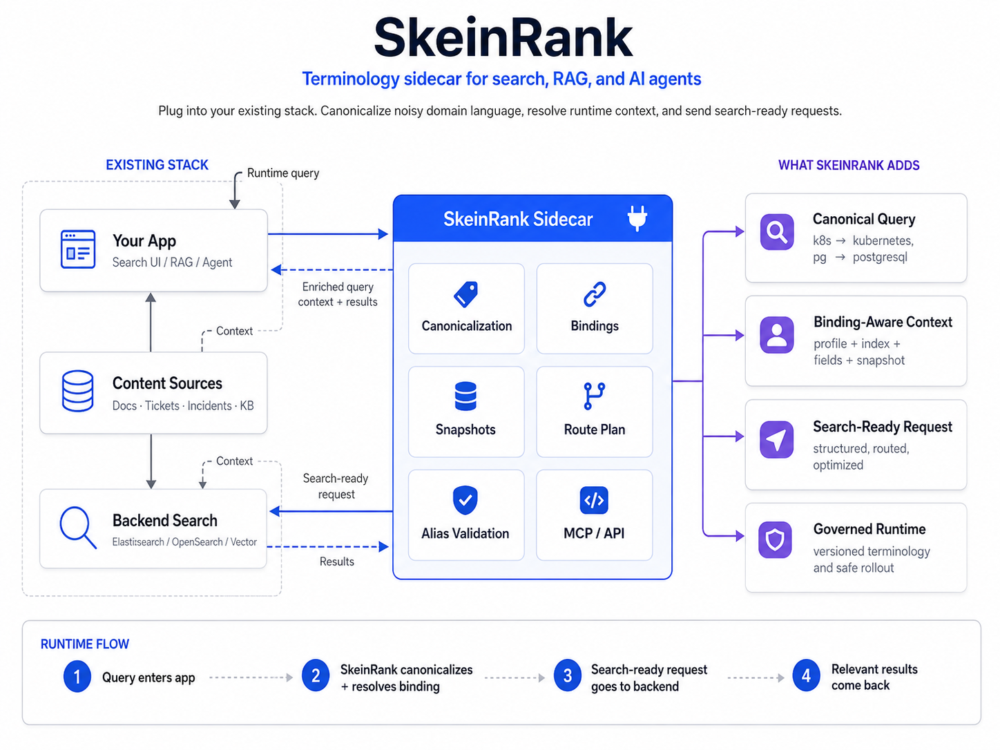

<p align="center">
  <a href="https://skeinrank.github.io">
    
  </a>
</p>

<h1 align="center">SkeinRank</h1>

<p align="center">
  <strong>Enterprise search and RAG break when users speak in internal slang. SkeinRank fixes that with governed, binding-aware terminology normalization.</strong>
</p>

<p align="center">
  <strong>Open-source Domain Language Control Plane for enterprise search, RAG, and AI-agent workflows.</strong>
</p>

<p align="center">
  SkeinRank acts as a Terminology Control Plane: it discovers internal terms and acronyms, validates them with evidence, resolves ambiguity by runtime context,
  ships immutable snapshots, and helps measure retrieval quality before and after every terminology change.
</p>

<p align="center">
  <a href="https://skeinrank.github.io">Website</a>
  ·
  <a href="https://skeinrank.github.io/docs/">Docs</a>
  ·
  <a href="https://skeinrank.github.io/quickstart/">Quickstart</a>
  ·
  <a href="https://pypi.org/project/skeinrank/">PyPI</a>
</p>

<p align="center">
  <a href="https://github.com/SkeinRank/skeinrank/actions/workflows/ci.yml">
    
  </a>
  <a href="https://pypi.org/project/skeinrank/">
    
  </a>
  <a href="LICENSE">
    
  </a>
  <a href="https://skeinrank.github.io">
    
  </a>
</p>

<p align="center">
  
</p>

<p align="center">
  <em>Drop SkeinRank into your stack as a terminology sidecar: canonicalize noisy domain language, resolve runtime context through bindings, and send search-ready requests to your backend.</em>
</p>

---

## The problem

Users do not search with your canonical vocabulary. They search with team slang, legacy abbreviations, incident shorthand, and ambiguous internal names:

```text
"k8s pg timeout"
```

Your systems may store the same idea as `kubernetes`, `Kube`, `PostgreSQL`, `postgres`, or `psql`. In another workspace, `pg` might mean `page` or `product group`. Search engines, vector databases, RAG prompts, and agents usually see that as noise.

SkeinRank gives that language a governed lifecycle instead of spreading it across Elasticsearch synonym files, regex snippets, CSVs, prompts, and one-off scripts.

## What SkeinRank does

SkeinRank is a **terminology sidecar** for teams that already run Elasticsearch, OpenSearch, vector search, internal documentation search, RAG, or AI-agent workflows.

It does not replace your search engine. It sits beside your application stack and turns messy company language into governed, versioned, binding-aware runtime context:

```text
raw query:        "k8s pg timeout"
canonical query:  "kubernetes postgresql timeout"
runtime context:  binding + profile + fields + pinned snapshot
```

In one pass, SkeinRank helps you:

| Step | What happens |
| --- | --- |
| Discover | Find internal terms, acronyms, aliases, and ambiguous surfaces. |
| Prove | Attach evidence from documents, incidents, tickets, and search traces. |
| Govern | Review proposed changes through AI Inbox and risk-aware policy. |
| Snapshot | Publish immutable terminology versions for runtime use. |
| Bind | Apply the right vocabulary to the right search context. |
| Serve | Expose API, SDK, CLI, and MCP tools for search, RAG, and agents. |
| Evaluate | Compare retrieval behavior before and after terminology changes. |

It is **not a direct production CRUD console**. Production terminology changes are expected to flow through `proposal -> validation -> risk policy -> review -> snapshot -> rollout` — the same safety posture as `proposal, validation, risk policy, review, snapshots`, and GitOps-style rollout.

See [`docs/product-positioning.md`](docs/product-positioning.md) for the product narrative and public-beta checklist.

## Why teams need this

Enterprise search and RAG often fail for reasons that are not model-related:

- the same thing is called `postgres`, `pg`, `psql`, and `PostgreSQL`;
- the same alias can mean different things in different workspaces;
- synonyms live in Elasticsearch, regex files, CSVs, prompts, and scripts;
- nobody knows which version of the rules is currently used in runtime;
- agents can discover new terminology, but should not mutate production directly.

SkeinRank turns that into an auditable control-plane flow:

```text
Discover -> Validate -> Review -> Publish snapshot -> Bind to runtime -> Enrich/search -> Evaluate
```

## Core model

| Concept | Meaning |
| --- | --- |
| `Profile` | Domain terminology: canonical values, aliases, slots, tags, stop lists. |
| `Binding` | Runtime search context: profile + index/alias + fields + target field + pinned snapshot. |
| `Snapshot` | Immutable version of terminology that can be safely served or exported. |
| `Proposal` | Agent, CLI, or human-submitted terminology change awaiting review. |
| `Evidence` | Documents, query traces, validation findings, and risk metadata behind a proposal. |

In production, runtime requests should be **binding-first**:

```json
{
  "binding_id": 1,
  "query": "k8s pg timeout"
}
```

`profile_name` remains useful for preview/dev workflows, but `binding_id` knows which index, fields, snapshot, filters, and runtime policy are active.

## Control Plane and Data Plane

```text
Control Plane: profiles, proposals, evidence, risk policy, snapshots, audit
Data Plane: immutable runtime snapshots, local canonicalization, enrichment/search integration
```

The focused UI is intentionally small:

```text
Playground -> debug query canonicalization
AI Inbox -> review evidence-backed agent proposals
Schema & Snapshots -> inspect profiles, bindings, aliases, and snapshot state
```

## What SkeinRank gives you

| Capability | Why it matters |
| --- | --- |
| Terminology governance | Manage canonical terms, aliases, slots, tags, guardrails, and review workflows in one place. |
| Binding-aware runtime | Resolve terminology by application scope, binding, search index, fields, and pinned snapshot. |
| Context-trigger disambiguation | Keep ambiguous aliases safe: `pg timeout` can map differently than `pg layout`. |
| Multi-binding route plans | Build read-only routing plans for `All docs` style search without executing search. |
| Evidence-assisted review | Check aliases against Elasticsearch/OpenSearch evidence before accepting changes. |
| Terminology-as-Code | Lint, plan, apply, export, and snapshot dictionaries through CI/GitOps workflows. |
| Enrichment safety | Preflight, blue/green alias swap, rollback, pause/resume, and chunk checkpointing. |
| MCP integration | Let Claude Desktop, Cursor-style IDE agents, and LangGraph-style agents inspect and submit proposals safely. |

## Quickstart: platform preview

Use Docker Compose when you want the full local preview: Governance API, PostgreSQL, Elasticsearch, RabbitMQ worker, and React UI.

```bash
cp .env.example .env
docker compose -f docker-compose.dev.yml up --build -d
```

Seed the platform demo:

```bash
make demo-reset
```

This loads the `platform_ops` profile, creates the `platform_knowledge_base` Elasticsearch index, adds evidence-backed AI Inbox proposals, and prepares the Playground plus Schema & Snapshots demo. The walkthrough lives in [`docs/guides/seeded-demo-walkthrough.md`](docs/guides/seeded-demo-walkthrough.md).

Run the one-command guided tour and smoke report:

```bash
make demo-tour
make demo-tour-smoke
```

The report is written to `examples/platform_ops_demo/reports/platform_ops_demo_tour_report.json`; the script is `examples/platform_ops_demo/demo_product_tour.py`. See [`docs/guides/demo-product-tour.md`](docs/guides/demo-product-tour.md).

Default local URLs:

| Service | URL |
| --- | --- |
| UI | `http://127.0.0.1:5173` |
| Governance API | `http://127.0.0.1:8010` |
| Elasticsearch | `http://127.0.0.1:19200` |
| RabbitMQ Management | `http://127.0.0.1:15672` |
| PostgreSQL | `127.0.0.1:15432` |

## Quickstart: local SDK / CLI

Use the lightweight core package when you want canonicalization without the full platform stack.

```bash
cd packages/skeinrank-core
poetry install

poetry run skeinrank validate-dictionary ../../examples/migration/console_dictionary.example.json
poetry run skeinrank validate-dictionary ../../examples/migration/console_dictionary.example.yaml
poetry run skeinrank extract "k8s rollout uses pg database" \
  --text \
  --dictionary ../../examples/migration/console_dictionary.example.json
```

Python SDK:

```python
from skeinrank import load_dictionary, extract_terms

dictionary = load_dictionary("examples/migration/console_dictionary.example.json")
result = extract_terms("k8s rollout uses pg database", dictionary=dictionary)

print(result.canonical_values)  # ["kubernetes", "postgresql"]
```

See [`docs/guides/core-sdk-and-cli.md`](docs/guides/core-sdk-and-cli.md).

## Quickstart: headless runtime

Use the API/PostgreSQL-only path when you want dictionary apply/export and runtime snapshot artifact smoke tests without the React UI, Elasticsearch, RabbitMQ, or Celery workers.

```bash
docker compose \
  --env-file deploy/docker/headless.env.example \
  -f docker-compose.headless.yml \
  up --build -d

deploy/docker/scripts/headless-golden-path.sh
```

The golden path applies `examples/migration/console_dictionary.example.json`, creates a local binding, exports `skeinrank.runtime_snapshot_artifact.v1`, and writes a portable artifact under `snapshots/`.

See [`docs/deployment/headless-quickstart.md`](docs/deployment/headless-quickstart.md).

## Runtime API surface

SkeinRank exposes binding-aware runtime endpoints for canonicalization, query planning, and search integration:

```text
POST /v1/text/canonicalize
POST /v1/query/plan
POST /v1/query/route-plan
POST /v1/search
POST /v1/search/multi
```

Patch 63A adds binding-aware canonicalization, Patch 63B adds context-trigger alias disambiguation, and Patch 63C adds the read-only multi-binding route plan API. The route-plan endpoint does not execute Elasticsearch; it only returns selected/rejected bindings, canonical queries, scores, and runtime context.

Read the guide: [`docs/guides/runtime-routing-api.md`](docs/guides/runtime-routing-api.md). Examples: [`examples/runtime-routing-api`](examples/runtime-routing-api). Context triggers: [`docs/guides/context-trigger-disambiguation.md`](docs/guides/context-trigger-disambiguation.md).

## Terminology-as-Code and GitOps

SkeinRank supports a safe file-based workflow for teams that manage terminology in Git.

The model is **YAML outside, JSON inside**:

- people review YAML/JSON dictionary artifacts in Git;
- the API receives and returns JSON;
- PostgreSQL remains the control-plane source of truth;
- runtime workers consume binding-scoped immutable snapshot artifacts.

```bash
cd packages/skeinrank-governance-api
poetry run skeinrank-migrate lint ../../examples/terminology-as-code/platform_ops.dictionary.yaml
poetry run skeinrank-migrate plan ../../examples/terminology-as-code/platform_ops.dictionary.yaml --output plan.json
poetry run skeinrank-migrate apply ../../examples/terminology-as-code/platform_ops.dictionary.yaml --plan-output applied-plan.json
poetry run skeinrank-migrate export --profile-name platform_ops --output dictionary.json
poetry run skeinrank-migrate snapshot-export --binding-id 1 --source latest --output runtime-snapshot.json
poetry run skeinrank-migrate snapshot-inspect runtime-snapshot.json
poetry run skeinrank-migrate snapshot-eval --before before.json --after after.json --queries queries.jsonl --output snapshot-evaluation.json
```

Docs and examples:

- [`docs/guides/terminology-as-code.md`](docs/guides/terminology-as-code.md)
- [`docs/guides/dictionary-cli-planning.md`](docs/guides/dictionary-cli-planning.md)
- [`docs/deployment/gitops-delivery-runbook.md`](docs/deployment/gitops-delivery-runbook.md)
- [`examples/terminology-as-code`](examples/terminology-as-code)
- [`examples/gitops-delivery`](examples/gitops-delivery)

## Enrichment safety

Elasticsearch/OpenSearch enrichment is treated as an operator workflow, not a casual UI action. Use preflight and blue/green alias swap for production-like runs.

Important surfaces:

```text
POST /v1/governance/elasticsearch/bindings/{binding_id}/dry-run
POST /v1/governance/elasticsearch/bindings/{binding_id}/jobs/preflight
POST /v1/governance/elasticsearch/bindings/{binding_id}/jobs
POST /v1/governance/elasticsearch/jobs/{job_id}/pause
POST /v1/governance/elasticsearch/jobs/{job_id}/resume
POST /v1/governance/elasticsearch/jobs/{job_id}/cancel
POST /v1/governance/elasticsearch/jobs/{job_id}/rollback
```

Runbooks:

- [`docs/guides/elasticsearch-enrichment.md`](docs/guides/elasticsearch-enrichment.md)
- [`docs/guides/enrichment-beta-hardening.md`](docs/guides/enrichment-beta-hardening.md)
- [`docs/deployment/blue-green-alias-swap-runbook.md`](docs/deployment/blue-green-alias-swap-runbook.md)
- [`docs/guides/enrichment-pause-resume-checkpointing.md`](docs/guides/enrichment-pause-resume-checkpointing.md)
- [`examples/blue-green-alias-swap`](examples/blue-green-alias-swap)

Operator path: create demo Elasticsearch index -> run enrichment job -> runtime search.

## MCP and agent integration

SkeinRank includes a dependency-light MCP stdio adapter. It exposes only proposal-safe tools; agents can inspect, validate, and submit pending proposals, but they do not publish snapshots or mutate runtime directly.

```bash
cd packages/skeinrank-governance-api
poetry run skeinrank-mcp --print-tool-manifest
poetry run skeinrank-mcp --print-env-template
poetry run skeinrank-mcp --smoke-test
```

MCP tools:

```text
skeinrank_list_bindings
skeinrank_explain_query
skeinrank_validate_alias
skeinrank_submit_alias_proposal
skeinrank_get_proposal_status
```

Docs and examples:

- [`docs/deployment/mcp-integration-kit.md`](docs/deployment/mcp-integration-kit.md)
- [`docs/deployment/mcp-scoped-credentials-smoke-tests.md`](docs/deployment/mcp-scoped-credentials-smoke-tests.md)
- [`docs/deployment/mcp-claude-desktop.md`](docs/deployment/mcp-claude-desktop.md)
- [`docs/deployment/mcp-cursor-agents.md`](docs/deployment/mcp-cursor-agents.md)
- [`docs/deployment/mcp-langgraph-agents.md`](docs/deployment/mcp-langgraph-agents.md)
- [`examples/mcp-integration-kit`](examples/mcp-integration-kit)
- [`examples/mcp-scoped-credentials`](examples/mcp-scoped-credentials)
- [`examples/mcp-agent-docs`](examples/mcp-agent-docs)
- [`examples/agents/openrouter_alias_scout`](examples/agents/openrouter_alias_scout) — offline alias-scout example for agent-driven terminology discovery.
- [`docs/guides/openrouter-agent.md`](docs/guides/openrouter-agent.md)

## Benchmarks and pilots

SkeinRank includes deterministic benchmark and pilot workflows that do not require OpenRouter or production data by default.

| Area | Commands / docs |
| --- | --- |
| Headless benchmark | `make benchmark-reset`, `make benchmark-seed`, `make benchmark-eval`, `make benchmark-report`; [`docs/benchmarks/headless-agent-workflow.md`](docs/benchmarks/headless-agent-workflow.md) |
| Containerized benchmark | `make benchmark-stack-run`; [`docs/benchmarks/containerized-benchmark-integration.md`](docs/benchmarks/containerized-benchmark-integration.md) |
| Retrieval eval | `make benchmark-retrieval-eval`, `make benchmark-retrieval-compare`; [`docs/benchmarks/retrieval-eval-baseline.md`](docs/benchmarks/retrieval-eval-baseline.md) |
| Synthetic smoke | `make benchmark-smoke-generate`; [`docs/benchmarks/synthetic-smoke-generator.md`](docs/benchmarks/synthetic-smoke-generator.md) |
| Performance report | `make benchmark-performance-report`; [`docs/benchmarks/cost-latency-throughput-report.md`](docs/benchmarks/cost-latency-throughput-report.md) |
| First-company pilot | `make pilot-plan`; [`docs/pilots/elasticsearch-pilot-integration.md`](docs/pilots/elasticsearch-pilot-integration.md) |

First-company operator docs:

- [`docs/pilots/first-company-pilot-runbook.md`](docs/pilots/first-company-pilot-runbook.md)
- [`examples/pilots/first_company_pilot_checklist.md`](examples/pilots/first_company_pilot_checklist.md)
- [`docs/pilots/troubleshooting-bundle-export.md`](docs/pilots/troubleshooting-bundle-export.md)
- [`docs/pilots/support-bundle-production.md`](docs/pilots/support-bundle-production.md)

## Documentation map

Start here:

- [`docs/overview.md`](docs/overview.md) — product overview and repository map.
- [`docs/product-positioning.md`](docs/product-positioning.md) — positioning, personas, demo story, and beta checklist.
- [`docs/concepts/terminology-control-plane.md`](docs/concepts/terminology-control-plane.md) — terminology, aliases, guardrails, evidence, and snapshots.
- [`docs/concepts/profiles-bindings-snapshots.md`](docs/concepts/profiles-bindings-snapshots.md) — why production runtime should be binding-first.
- [`docs/concepts/headless-runtime-contracts.md`](docs/concepts/headless-runtime-contracts.md) — Control Plane / Data Plane boundaries.
- [`docs/adr/0001-headless-runtime-contracts.md`](docs/adr/0001-headless-runtime-contracts.md) — architecture decision record.
- [`docs/concepts/dictionary-spec-v1.md`](docs/concepts/dictionary-spec-v1.md) — stable dictionary import/export contract.
- [`docs/concepts/coverage-framework.md`](docs/concepts/coverage-framework.md) — tags, ambiguous aliases, binding policies, and evaluation.
- [`docs/guides/coverage-framework.md`](docs/guides/coverage-framework.md) — coverage review API examples.
- [`examples/coverage-framework`](examples/coverage-framework) — coverage examples.
- [`docs/api/governance-api.md`](docs/api/governance-api.md) — governance and runtime API surfaces.
- [`docs/guides/governance-console.md`](docs/guides/governance-console.md) — governance API and UI workflows.
- [`docs/guides/proposal-inbox-ui.md`](docs/guides/proposal-inbox-ui.md) — AI Inbox review details.
- [`docs/guides/development.md`](docs/guides/development.md) — development checks and package layout.

Deployment docs:

- [`docs/deployment/docker-images.md`](docs/deployment/docker-images.md) — GHCR image publishing, automatic tag builds, and manual rebuilds for existing tags.
- [`docs/deployment/helm-chart.md`](docs/deployment/helm-chart.md) — alpha Helm chart for Kubernetes installs using the published GHCR images.
- [`docs/deployment/helm-production.md`](docs/deployment/helm-production.md) — production-oriented Helm values, ingress, PDB, resources, and secret strategy.
- [`docs/deployment/helm-smoke-test.md`](docs/deployment/helm-smoke-test.md) — optional kind smoke test for the alpha Helm chart.
- [`docs/deployment/docker-compose.md`](docs/deployment/docker-compose.md)
- [`docs/deployment/headless-quickstart.md`](docs/deployment/headless-quickstart.md)
- [`docs/deployment/production-compose.md`](docs/deployment/production-compose.md)
- [`docs/deployment/dev-stack-troubleshooting.md`](docs/deployment/dev-stack-troubleshooting.md)
- [`docs/deployment/security.md`](docs/deployment/security.md)
- [`docs/deployment/env-and-secrets.md`](docs/deployment/env-and-secrets.md)
- [`docs/deployment/observability.md`](docs/deployment/observability.md)
- [`docs/deployment/backup-restore.md`](docs/deployment/backup-restore.md)
- [`docs/deployment/upgrade-guide.md`](docs/deployment/upgrade-guide.md)
- [`docs/deployment/migration-safety.md`](docs/deployment/migration-safety.md)
- [`docs/deployment/release-checklist.md`](docs/deployment/release-checklist.md)

## Repository layout

```text
packages/skeinrank-core                    Python SDK, CLI, extraction, canonicalization
packages/skeinrank-server                  FastAPI runtime wrapper for extraction/rerank workflows
packages/skeinrank-provider-elasticsearch  Elasticsearch provider and enrichment CLI
packages/skeinrank-governance              SQLAlchemy/Alembic governance foundation
packages/skeinrank-governance-api          FastAPI governance/control-plane API, workers, MCP adapter
packages/skeinrank-ui                      React/TypeScript governance console
examples/platform_ops_demo                 Local preview seed data and guided tour automation
examples/migration                         Example dictionary import/export payloads
examples/coverage-framework                Tags, ambiguous alias, binding policy, and evaluation examples
deploy/                                    Dockerfiles, Prometheus, Grafana, OpenTelemetry config
docs/                                      Product, concept, guide, API, and deployment docs
```

## Development checks

Run repository-level hygiene from the root:

```bash
python -m pip install -r requirements-dev.txt
pre-commit install
ruff check .
ruff format --check .
```

Run package tests from each package directory with its own tooling. For example:

```bash
cd packages/skeinrank-core
poetry install
poetry run pytest -q
```

The GitHub Actions workflow uses path-aware routing so docs/deployment changes do not run unrelated package installs, while package and UI changes still run their own checks. See [`docs/deployment/ci-routing.md`](docs/deployment/ci-routing.md).

## Docker Compose dev stack

Use the dev stack when you want to build SkeinRank from source and run the full local preview with PostgreSQL, Elasticsearch, RabbitMQ, the Governance API, worker, and UI. See [`docs/deployment/docker-compose.md`](docs/deployment/docker-compose.md) for the full install flow, [`docs/deployment/dev-stack-troubleshooting.md`](docs/deployment/dev-stack-troubleshooting.md) for common local failures, [`docs/deployment/security.md`](docs/deployment/security.md) for deployment/security notes, and [`docker-compose.prod.yml`](docker-compose.prod.yml) for the production-oriented Compose template.

```bash
cp .env.example .env
docker compose -f docker-compose.dev.yml up --build -d
```

## Docker images and Compose

Release images are published to GHCR by `.github/workflows/docker-publish.yml`. The workflow runs automatically for `v*` git tags and can be launched manually for an existing tag such as `v0.10.0-beta.1`. See [`docs/deployment/docker-images.md`](docs/deployment/docker-images.md).

Run the public beta from prebuilt GHCR images:

```bash
cp .env.example .env
docker compose up -d
```

`docker-compose.yml` pulls the API, worker, and UI images automatically. Users do not need to run separate `docker pull` commands. See [`docs/deployment/release-compose.md`](docs/deployment/release-compose.md).

## Docker Compose stacks

SkeinRank includes Compose profiles for release evaluation, local development, headless runtime, and production-oriented deployment.

Main files:

- [`docker-compose.yml`](docker-compose.yml) — release stack using GHCR images.
- [`.env.example`](.env.example) — release Compose environment template.
- [`charts/skeinrank`](charts/skeinrank) — alpha Helm chart for Kubernetes installs using the same GHCR images.
- [`docker-compose.dev.yml`](docker-compose.dev.yml) — local development stack built from source.
- [`docker-compose.headless.yml`](docker-compose.headless.yml) — API/PostgreSQL-only headless stack.
- [`docker-compose.prod.yml`](docker-compose.prod.yml) — production-oriented stack.
- [`.env.production.example`](.env.production.example) — production Compose environment template.
- [`docs/deployment/release-compose.md`](docs/deployment/release-compose.md) — public beta release stack with GHCR images.
- [`docs/deployment/docker-compose.md`](docs/deployment/docker-compose.md) — full local setup, including dictionary import, create demo Elasticsearch index, run enrichment job, and runtime search.
- [`docs/deployment/dev-stack-troubleshooting.md`](docs/deployment/dev-stack-troubleshooting.md) — local stack troubleshooting.
- [`docs/deployment/security.md`](docs/deployment/security.md) — deployment and security notes.


## Community

- Use [Issues](https://github.com/SkeinRank/skeinrank/issues) for reproducible bugs, failing commands, docs mistakes, and concrete implementation tasks.
- Use [Discussions](https://github.com/SkeinRank/skeinrank/discussions) for questions, ideas, architecture proposals, integration feedback, and public beta conversations.
- See [`docs/community/discussions.md`](docs/community/discussions.md) for discussion categories and pinned discussion drafts.
- See [`docs/community/github-labels.md`](docs/community/github-labels.md) for the repository label taxonomy and GitHub CLI sync commands.

## Project status

SkeinRank is an active open-source platform preview, not a hosted SaaS. The current focus is binding-aware runtime canonicalization, safe terminology governance, AI Inbox review, Terminology-as-Code, MCP agent integration, and Elasticsearch/OpenSearch enrichment safety.

## License

Apache-2.0. See [`LICENSE`](LICENSE).
