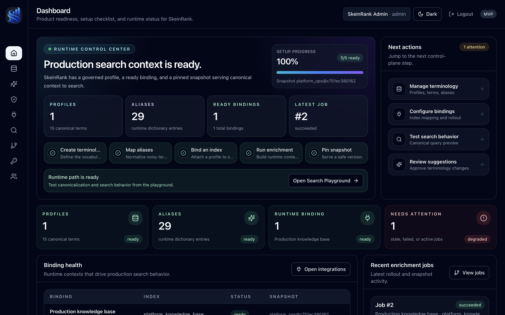

<p align="center">
  <a href="https://skeinrank.github.io">
    
  </a>
</p>

<h1 align="center">SkeinRank</h1>

<p align="center">
  <strong>Open-source terminology control plane for search and RAG.</strong>
</p>

<p align="center">
  Turn messy aliases such as <code>k8s</code>, <code>kube</code>, <code>pg</code>, and <code>postgres</code>
  into governed, versioned runtime context for enterprise search, Elasticsearch, and RAG workflows.
</p>

<p align="center">
  <a href="https://skeinrank.github.io">Website</a>
  ·
  <a href="https://skeinrank.github.io/docs/">Docs</a>
  ·
  <a href="https://skeinrank.github.io/quickstart/">Quickstart</a>
  ·
  <a href="https://pypi.org/project/skeinrank/">PyPI</a>
</p>

<p align="center">
  <a href="https://github.com/SkeinRank/skeinrank/actions/workflows/ci.yml">
    
  </a>
  <a href="https://pypi.org/project/skeinrank/">
    
  </a>
  <a href="LICENSE">
    
  </a>
  <a href="https://skeinrank.github.io">
    
  </a>
</p>

<p align="center">
  <a href="https://skeinrank.github.io">
    
  </a>
</p>

---

SkeinRank helps teams make company terminology usable at runtime: normalize noisy domain language, govern canonical terms and aliases, publish immutable snapshots, enrich indexed documents, and serve search-ready context to retrieval, RAG, and agent workflows.

The repository includes a lightweight Python SDK/CLI, FastAPI runtime and governance APIs, a React governance console, PostgreSQL-backed control-plane state, Elasticsearch enrichment jobs, RabbitMQ/Celery workers, and Docker Compose deployment profiles.

## What SkeinRank gives you

| Capability | Why it matters |
| --- | --- |
| Terminology governance | Manage canonical terms, aliases, slots, guardrails, and review workflows in one control plane. |
| Runtime bindings | Bind a profile to a concrete index/search context and pin the safe snapshot used at runtime. |
| Evidence-assisted review | Check aliases against Elasticsearch documents before accepting terminology changes. |
| Enrichment jobs | Write canonical values, slots, matched aliases, and snapshot metadata back into indexed documents. |
| Search Playground | Preview how raw queries become governed runtime context before integrating downstream search/RAG. |

## Why SkeinRank

Internal knowledge rarely uses one clean vocabulary. The same concept can appear as `k8s`, `kube`, `kubernetes`, `pg`, `postgres`, `postgresql`, service nicknames, team-specific abbreviations, and incident shorthand.

Search and RAG systems usually see that as noise. SkeinRank turns it into a managed lifecycle:

```text
Discover → Validate → Review → Publish snapshot → Bind to runtime → Enrich/search → Evaluate
```

The core idea is simple:

```text
Profile = domain terminology
Binding = where and how that terminology is applied
Snapshot = immutable runtime version
Evidence = why a term or alias should be trusted
```

## Quickstart: platform preview

Use Docker Compose when you want to try the full platform: governance console, API, PostgreSQL, Elasticsearch, RabbitMQ worker, and UI.

```bash
cp .env.example .env
docker compose -f docker-compose.dev.yml up --build -d
```

Populate the console with a live demo dataset:

```bash
make demo-reset
```

This loads `examples/platform_ops_demo`, creates the `platform_ops` profile, binds it to the `platform_knowledge_base` Elasticsearch index, creates review suggestions, checks evidence, and runs enrichment for the Dashboard, Terms, Integrations, Suggestions, Search Playground, and Snapshots screens.

Default local URLs:

| Service | URL |
| --- | --- |
| UI | `http://127.0.0.1:5173` |
| Governance API | `http://127.0.0.1:8010` |
| Elasticsearch | `http://127.0.0.1:19200` |
| RabbitMQ Management | `http://127.0.0.1:15672` |
| PostgreSQL | `127.0.0.1:15432` |

Full instructions live in [`docs/deployment/docker-compose.md`](docs/deployment/docker-compose.md).


## Quickstart: headless runtime

Use the headless Compose profile when you want the automation-first path without the React UI, Elasticsearch, RabbitMQ, or Celery workers. It starts PostgreSQL, runs migrations, and exposes the Governance API for dictionary apply/export and runtime snapshot artifact smoke tests.

```bash
docker compose \
  --env-file deploy/docker/headless.env.example \
  -f docker-compose.headless.yml \
  up --build -d

deploy/docker/scripts/headless-golden-path.sh
```

The golden path applies `examples/migration/console_dictionary.example.json`, creates a local binding, exports `skeinrank.runtime_snapshot_artifact.v1`, and writes a portable artifact under `snapshots/`.

Full instructions live in [`docs/deployment/headless-quickstart.md`](docs/deployment/headless-quickstart.md).

## Headless dictionary API

Use the headless dictionary facade when CI jobs, agents, or service integrations
need to validate, apply, or export dictionary spec v1 payloads without relying on
console-specific route names.

```text
POST /v1/headless/dictionaries/validate
POST /v1/headless/dictionaries/apply
GET  /v1/headless/dictionaries/export?profile_name=...
```

The legacy `/v1/console/dictionary/*` routes remain available for the governance
console and older scripts. Both surfaces share the same validation/apply logic.

## Agent-ready proposals and validation

Phase B extends the existing suggestions review queue into an agent-safe proposal
path. Manual suggestions still work as before, while agents, CLI jobs, and
service integrations can attach optional `binding_id`, `proposal_source_type`,
`proposal_source_name`, `idempotency_key`, and `source_payload` fields. When a
caller does not provide `validation_summary`, SkeinRank now runs a proposal
checker registry and stores structured results for canonical availability, alias
collisions, stop-list guardrails, noisy aliases, confidence, idempotency hints,
and agent audit payloads. These records remain pending until a moderator/admin
reviews them, so LLMs and agents do not mutate runtime terminology directly.

Patch 37C adds a small REST tool facade for agents and service integrations that
need stable, task-shaped calls without learning the full console API surface:

```text
GET  /v1/tools/bindings
POST /v1/tools/validate-alias
POST /v1/tools/suggest-alias
POST /v1/tools/explain-query
```

The tools reuse the same proposal validation registry and runtime query planner.
They create pending suggestions only through `suggest-alias`; validation and
query explanation are read-only.

Patch 37D adds an atomic batch apply and snapshot publish path for reviewed
proposals:

```text
POST /v1/governance/profiles/{profile_name}/suggestions/apply-batch
```

A moderator/admin can apply selected pending suggestions in one transaction and,
when a `binding_id` is provided, pin a fresh runtime snapshot on that binding.
This keeps agent proposals separate from production terminology until a reviewed
batch is intentionally released.

Patch 37F adds a dependency-light MCP stdio adapter on top of the REST tools:

```bash
cd packages/skeinrank-governance-api
poetry run skeinrank-mcp --api-url http://127.0.0.1:8010
```

The MCP server exposes `skeinrank_list_bindings`, `skeinrank_explain_query`,
`skeinrank_validate_alias`, `skeinrank_submit_alias_proposal`, and
`skeinrank_get_proposal_status`. It does not own business logic; it only adapts
MCP tool calls to the existing `/v1/tools/*` and proposal review APIs.

Patch 37G adds proposal metrics and source quality reporting so reviewers can
identify useful agents and noisy sources:

```text
GET /v1/governance/proposals/source-quality
GET /metrics
```

## OpenRouter alias scout foundation

Patch 40F adds a dependency-light reference runner for agent integrations:

```bash
python examples/agents/openrouter_alias_scout/run_alias_scout.py --dry-run-plan
```

Patch 40G adds the OpenRouter/OpenAI-compatible layer around that runner:

```bash
python examples/agents/openrouter_alias_scout/run_alias_scout.py --print-tool-schemas
python examples/agents/openrouter_alias_scout/run_alias_scout.py --print-system-prompt
python examples/agents/openrouter_alias_scout/run_alias_scout.py --print-sample-review-prompt
```

Patch 40H adds the local candidate discovery/pruning step before any LLM call:

```bash
python examples/agents/openrouter_alias_scout/run_alias_scout.py --discover-candidates
python examples/agents/openrouter_alias_scout/run_alias_scout.py --print-sample-candidate-pack
```

Patch 40I adds compact evidence sampling around discovered candidates:

```bash
python examples/agents/openrouter_alias_scout/run_alias_scout.py --sample-evidence
python examples/agents/openrouter_alias_scout/run_alias_scout.py --print-sample-evidence-pack
```

Patch 40K adds the local E2E demo report:

```bash
python examples/agents/openrouter_alias_scout/run_alias_scout.py --run-demo-report
python examples/agents/openrouter_alias_scout/run_alias_scout.py --print-demo-review-prompt
make agent-demo
```

Patch 40J adds the first live OpenRouter execution path: export
`OPENROUTER_API_KEY`, run `--print-llm-review-plan` for an offline preview, then
run `--llm-review --model openai/gpt-4o-mini --max-candidates 3` to obtain strict
`propose`, `reject`, or `needs_evidence` judgments. The workflow emits
`skeinrank.agent_llm_review_report.v1`, is LangGraph-ready, and still does not
submit proposals or mutate SkeinRank state by default. The schemas map only to
existing `/v1/tools/*` routes, so agents can validate and submit proposals later,
but runtime terminology changes only through reviewed batches and snapshots. See
[`examples/agents/openrouter_alias_scout`](examples/agents/openrouter_alias_scout).

## Quickstart: local SDK / CLI

Use the lightweight `skeinrank` package path when you want to validate a dictionary or test canonicalization without starting platform services. Dictionary files should declare `schema_version: skeinrank.dictionary.v1`; JSON is canonical, and YAML is accepted for CLI input.

```bash
cd packages/skeinrank-core
poetry install

poetry run skeinrank validate-dictionary ../../examples/migration/console_dictionary.example.json
poetry run skeinrank validate-dictionary ../../examples/migration/console_dictionary.example.yaml
poetry run skeinrank extract "k8s rollout uses pg database" \
  --text \
  --dictionary ../../examples/migration/console_dictionary.example.json
```

Python SDK:

```python
from skeinrank import load_dictionary, extract_terms

dictionary = load_dictionary("examples/migration/console_dictionary.example.json")
result = extract_terms("k8s rollout uses pg database", dictionary=dictionary)

print(result.canonical_values)  # ["kubernetes", "postgresql"]
```

See [`docs/guides/core-sdk-and-cli.md`](docs/guides/core-sdk-and-cli.md) for CLI, SDK, document extraction, packaging, and publishing notes.

## Documentation

Start here:

- [`docs/overview.md`](docs/overview.md) — product overview and repository map.
- [`docs/concepts/terminology-control-plane.md`](docs/concepts/terminology-control-plane.md) — terminology, aliases, guardrails, evidence, and snapshots.
- [`docs/concepts/profiles-bindings-snapshots.md`](docs/concepts/profiles-bindings-snapshots.md) — why production runtime should be binding-first.
- [`docs/concepts/headless-runtime-contracts.md`](docs/concepts/headless-runtime-contracts.md) — headless-first runtime contracts, proposal-safe agents, and UI scope.
- [`docs/concepts/dictionary-spec-v1.md`](docs/concepts/dictionary-spec-v1.md) — stable dictionary import/export contract with `schema_version`.
- [`docs/concepts/coverage-framework.md`](docs/concepts/coverage-framework.md) — coverage framework for tags, ambiguous aliases, binding policies, and safe evaluation.
- [`docs/adr/0001-headless-runtime-contracts.md`](docs/adr/0001-headless-runtime-contracts.md) — architecture decision for headless runtime boundaries.
- [`docs/guides/core-sdk-and-cli.md`](docs/guides/core-sdk-and-cli.md) — local SDK/CLI workflows.
- [`docs/guides/governance-console.md`](docs/guides/governance-console.md) — governance API and UI workflows.
- [`docs/guides/coverage-framework.md`](docs/guides/coverage-framework.md) — API examples for coverage review, policy, and before/after evaluation.
- [`docs/guides/elasticsearch-enrichment.md`](docs/guides/elasticsearch-enrichment.md) — enrichment, dry-runs, jobs, evidence, and cancellation.
- [`docs/guides/development.md`](docs/guides/development.md) — development checks and package layout.
- [`docs/api/governance-api.md`](docs/api/governance-api.md) — important governance/runtime API surfaces.

Deployment docs:

- [`docs/deployment/docker-compose.md`](docs/deployment/docker-compose.md)
- [`docs/deployment/security.md`](docs/deployment/security.md)
- [`docs/deployment/observability.md`](docs/deployment/observability.md)
- [`docs/deployment/dev-stack-troubleshooting.md`](docs/deployment/dev-stack-troubleshooting.md)

## Repository layout

```text
packages/skeinrank-core                    Lightweight Python SDK, CLI, extraction, canonicalization
packages/skeinrank-server                  FastAPI runtime wrapper for extraction/rerank workflows
packages/skeinrank-provider-elasticsearch  Elasticsearch provider and enrichment CLI
packages/skeinrank-governance              SQLAlchemy/Alembic governance foundation
packages/skeinrank-governance-api          FastAPI governance/control-plane API and worker
packages/skeinrank-ui                      React/TypeScript governance console
examples/platform_ops_demo                 Local preview seed data and automation
examples/demo                              Demo corpus, queries, enriched documents, eval output
examples/migration                         Example dictionary import/export payloads
examples/coverage-framework                Phase C tags, ambiguous alias, binding policy, and evaluation examples
deploy/                                    Dockerfiles, Prometheus, Grafana, OpenTelemetry config
docs/                                      Product, concept, guide, API, and deployment docs
```

## Development checks

Run repository-level hygiene from the root:

```bash
python -m pip install -r requirements-dev.txt
pre-commit install
ruff check .
ruff format --check .
```

Run package tests from each package directory with its own tooling. For example:

```bash
cd packages/skeinrank-core
poetry install
poetry run pytest -q
```

The GitHub Actions workflow runs Ruff, package tests, UI type checks/tests/builds, and Docker/deployment smoke checks.

## Docker Compose dev stack

SkeinRank includes Docker Compose profiles for local development and production-like deployment.

Main files:

- [`docker-compose.dev.yml`](docker-compose.dev.yml) — local development stack.
- [`docker-compose.headless.yml`](docker-compose.headless.yml) — API/PostgreSQL-only headless stack.
- [`docker-compose.prod.yml`](docker-compose.prod.yml) — production-oriented stack.
- [`docs/deployment/docker-compose.md`](docs/deployment/docker-compose.md) — Docker Compose setup guide.
- [`docs/deployment/headless-quickstart.md`](docs/deployment/headless-quickstart.md) — API-only golden path for dictionary apply and snapshot artifact export.
- [`docs/deployment/dev-stack-troubleshooting.md`](docs/deployment/dev-stack-troubleshooting.md) — local stack troubleshooting.
- [`docs/deployment/security.md`](docs/deployment/security.md) — deployment and security notes.

## Project status

SkeinRank is an active open-source platform preview, not a hosted SaaS. The current focus is terminology governance, profile bindings, snapshot-safe runtime context, Elasticsearch enrichment, evidence-assisted review, Search Playground workflows, and local Docker Compose deployment.

## License

Apache-2.0. See [`LICENSE`](LICENSE).

### Headless snapshot artifacts

Phase A adds a binding-first snapshot artifact export for GitOps/headless runtime flows: `GET /v1/headless/snapshots/export?binding_id=...` or `skeinrank-migrate snapshot-export --binding-id ... --output runtime-snapshot.json`.


### Runtime snapshot artifact loading

Headless workers can export a binding-scoped runtime artifact and inspect it locally:

```bash
skeinrank-migrate snapshot-export --binding-id 1 --output runtime-snapshot.json
skeinrank-migrate snapshot-inspect runtime-snapshot.json
```

The artifact loader/cache validates `skeinrank.runtime_snapshot_artifact.v1` and keeps the immutable runtime read model available without querying PostgreSQL on every request.


### Patch 38A/38B: term tags in governance and runtime

Dictionary terms and governance term APIs now accept optional `tags` on canonical
terms. Tags are normalized, deduplicated facets (`infra`, `backend`, `storage`)
that complement the primary `slot`. Runtime snapshot alias entries now carry
those tags too, so exported artifacts and query/canonicalization debug output
can explain both the primary slot and richer term facets.


- Conflict detection report with severity and persisted review state for alias drift, stop-list collisions, and pending proposal conflicts.

- Coverage framework now includes term tags, conflict review state, and ambiguous alias candidates for controlled multi-interpretation review. Conflicting alias proposals now automatically populate ambiguous alias candidates for reviewer follow-up without changing active runtime terminology.

### Binding policies

Phase C adds binding policies as the bridge between ambiguous alias candidates and future runtime resolution. A policy belongs to a binding and can record preferred slots, allowed tags, denied slots, and context-specific rules such as `pg -> postgresql` for an infra binding.

### Patch 38I: snapshot before/after evaluation

Runtime snapshot artifacts can be compared before publishing a new terminology
release. The evaluator reports alias additions/removals/changes, tag drift, and
optional sample-query canonicalization diffs:

```bash
skeinrank-migrate snapshot-eval \
  --before snapshots/platform_ops.before.json \
  --after snapshots/platform_ops.after.json \
  --queries examples/evaluation/queries.jsonl \
  --output snapshot-evaluation.json
```

This is an offline guardrail for the coverage framework: teams can see whether a
new snapshot expands recall safely or changes query plans in risky ways before
promoting it to runtime.

### Patch 38J: coverage docs and examples

Phase C documentation is collected in [`docs/concepts/coverage-framework.md`](docs/concepts/coverage-framework.md) and [`docs/guides/coverage-framework.md`](docs/guides/coverage-framework.md). Example payloads live in [`examples/coverage-framework`](examples/coverage-framework) and show a complete controlled-coverage flow: tagged dictionary, ambiguous `pg` candidates, infra/docs binding policies, and snapshot-evaluation queries.

## Patch 40L — OpenRouter agent security profile

Patch 40L adds a safe service-account profile to the OpenRouter alias scout. The
runner can now print and validate a redacted security report before live model
review:

```bash
python examples/agents/openrouter_alias_scout/run_alias_scout.py --print-security-profile
python examples/agents/openrouter_alias_scout/run_alias_scout.py --check-security-profile
```

The report schema is `skeinrank.agent_security_profile.v1`. Proposal submission
remains disabled by default; the agent may prepare proposal payloads, but it
must not directly write dictionaries, publish snapshots, push to Git, or mutate
runtime state.

## Patch 40M — OpenRouter agent budget and cache

Patch 40M adds run budgets and JSON response caching to the OpenRouter alias
scout. It keeps the agent safe by default: no backend routes are changed,
proposal submission stays disabled, and cached responses never mutate runtime
state. Use `--print-budget-cache-plan` for an offline `skeinrank.agent_budget_cache_plan.v1`
preview, `--max-llm-calls` / `--max-run-cost-usd` for live-run limits, and
`--clear-llm-cache` to remove the configured local cache.
## Patch 40N — Agent evaluation loop

Patch 40N adds an offline evaluation report for the OpenRouter alias scout. It
can score the local demo pipeline or a saved `skeinrank.agent_llm_review_report.v1`
without calling OpenRouter, SkeinRank, Elasticsearch, or publishing snapshots.

```bash
python examples/agents/openrouter_alias_scout/run_alias_scout.py --run-evaluation-report
python examples/agents/openrouter_alias_scout/run_alias_scout.py \
  --llm-review-report /tmp/skeinrank-alias-scout-llm-report.json \
  --run-evaluation-report
```

The output schema is `skeinrank.agent_evaluation_report.v1`. It reports
evidence coverage, LLM action mix, proposal-ready counts, optional human/policy
outcomes (`accepted`, `rejected`, `blocked`, `ambiguous`, `noisy`, `conflict`),
cost/cache summary, and a quality gate. Snapshot before/after evaluation remains
disabled until approved proposals are applied through the governed workflow.

### Patch 40O — Agent deployment recipe

Patch 40O adds a Docker Compose deployment recipe for the OpenRouter alias scout.
Use `--print-deployment-recipe` to inspect the offline `skeinrank.agent_deployment_recipe.v1` report, or `make agent-deploy-plan` / `make agent-compose-config` from the repository root. The reference service defaults to an offline evaluation report; proposal submission and runtime mutation remain disabled.

## Patch 41A — Canonical hints and stronger review pack

Patch 41A improves the OpenRouter alias scout quality loop without changing backend routes or mutating runtime state. The runner now includes configured canonical hints in each candidate pack, so the model can choose from known terms such as `kubernetes`, `postgresql`, `elasticsearch`, and `rabbitmq` instead of guessing from raw evidence only.

```bash
python examples/agents/openrouter_alias_scout/run_alias_scout.py --print-canonical-hints
python examples/agents/openrouter_alias_scout/run_alias_scout.py --print-sample-evidence-pack
```

The report schema is `skeinrank.agent_canonical_hints.v1`. Validation-sprint noise such as `queue`, `red`, and `shard` is pruned before LLM review by default, while real alias candidates such as `pg`, `k8s`, and `kube` receive `possible_canonical`, `slot`, `canonical_hint`, `canonical_candidates`, and `known_canonicals` fields in the review pack.


## Patch 41B — Validate and submit proposals safely

Patch 41B connects high-confidence agent `proposal_payload` values to the
existing SkeinRank agent tools without changing backend routes. The runner can
preview a submission plan, validate ready proposals through
`POST /v1/tools/validate-alias`, and optionally submit pending proposals through
`POST /v1/tools/suggest-alias` only when explicitly requested and allowed by
security/config.

```bash
python examples/agents/openrouter_alias_scout/run_alias_scout.py \
  --llm-review-report /tmp/skeinrank-41a-llm-report.json \
  --print-proposal-submission-plan

python examples/agents/openrouter_alias_scout/run_alias_scout.py \
  --llm-review-report /tmp/skeinrank-41a-llm-report.json \
  --validate-ready-proposals
```

Submission remains opt-in and governed. It creates pending proposals only; it
never writes directly to dictionaries, never pushes Git, and never publishes
runtime snapshots.

## Patch 41C — Agent validation statuses and idempotent proposal handling

Patch 41C keeps proposal submission safe while making validation reports more
useful for agent workflows. Validation warnings are now classified before any
optional submission: existing aliases that already map to the requested canonical
are treated as idempotent no-ops, slot mismatches are routed to manual review,
and blocked validations are never submitted.

This means an agent run can distinguish:

```text
passed → eligible for optional submission
existing alias warning → idempotent_existing_alias
slot mismatch warning → manual_review_required
blocked → blocked
```

The runner still does not mutate runtime dictionaries or publish snapshots.

